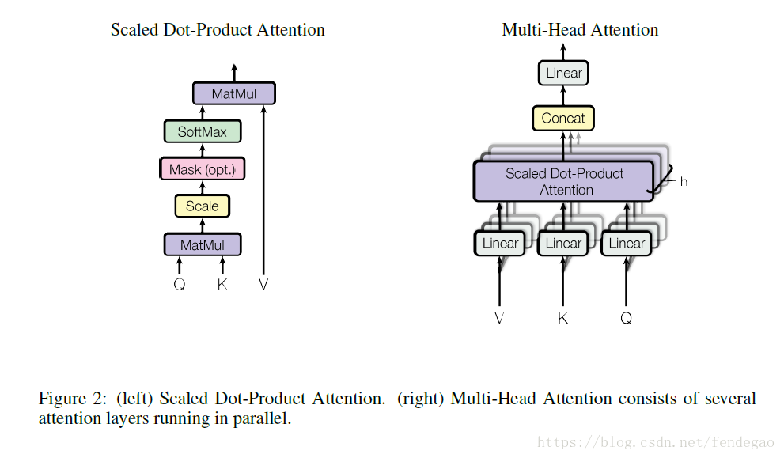
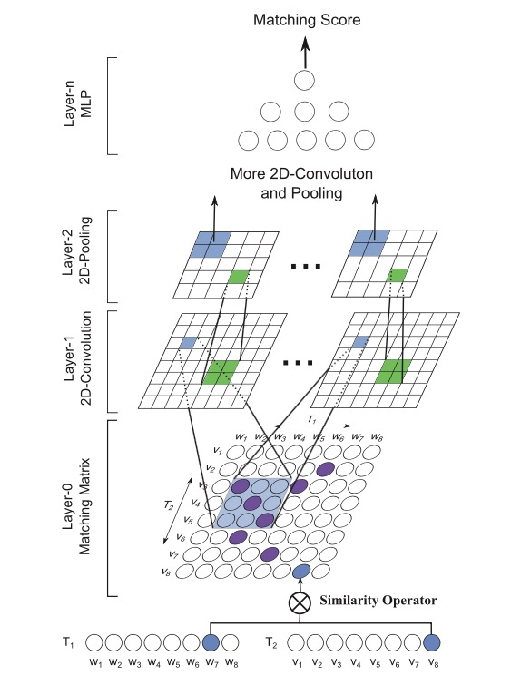
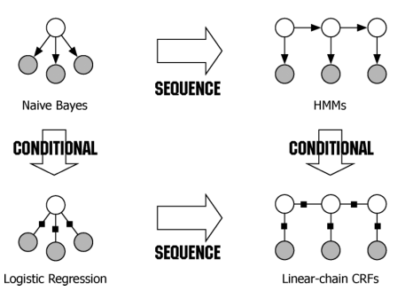

# transformer_crf
transformer crf 命名实体识别
### transformer
[Attention Is All You Need](https://arxiv.org/abs/1706.03762)    
  
---
### match pyramid
[Text Matching as Image Recognition](https://arxiv.org/abs/1602.06359)    
  
---
### 条件随机场
[An Introduction to Conditional Random Fields](http://120.52.51.17/homepages.inf.ed.ac.uk/csutton/publications/crftut-fnt.pdf)    
  
---
##### Result
>| Network + CRF        |    acc    |  precision  |    recall   |  f1-score  |
>|----------------------|-----------|-------------|-------------|------------|
>| Transformer          |  0.9231   |   0.7428    |   0.6692    |   0.7041   |
>| Transformer+Bi-LSTM  |  0.9712   |   0.9293    |   0.9353    |   0.9323   |
>| Bi-LSTM+Transformer  |  0.966    |   0.9129    |   0.9041    |   0.9085   |
>| Bi-LSTM              |  0.9684   |   0.9086    |   0.9106    |   0.9096   |
>| 2 layer Bi-LSTM      |  0.9682   |   0.9183    |   0.9147    |   0.9165   |
>| match-pyramid Bi-LSTM|  0.9382   |   0.8708    |   0.8253    |   0.8474   |
>| CNN + Bi-LSTM        |  0.9664	|   0.9162    |   0.9139    |   0.9139   |
>| Bi-LSTM + CNN        |  0.9678   |   0.9202    |   0.9147    |   0.9174   |
>| Transformer+Bi-GRU   |  0.9723   |   0.9352    |   0.9332    |   0.9342   |
>| Bi-GRU+Transformer   |  0.965    |   0.9032    |   0.9052    |   0.9042   |
>| Bi-GRU               |  0.9682   |   0.933     |   0.9159    |   0.9244   |
>| CNN + Bi-GRU         |  0.9681	|   0.9254    |   0.9217    |   0.9235   |
>| Bi-GRU + CNN         |  0.9687   |   0.9166    |   0.9157    |   0.9161   |
>| Transformer+Bi-IndRNN|  0.9562   |   0.852     |   0.8685    |   0.8602   |
>| Bi-IndRNN            |  0.9331   |   0.7991    |   0.7414    |   0.7691   |
>| Transformer+Bi-F-LSTM|  0.9695   |   0.9246    |   0.9116    |   0.9181   |
>| Bi-F-LSTM            |  0.9573   |   0.8774    |   0.8718    |   0.8746   |
>| Transformer+Bi-RNN   |  0.9706   |   0.9228    |   0.9149    |   0.9188   |
>| Bi-RNN               |  0.9639   |   0.9124    |   0.9095    |   0.911    |
>| CNN                  |  0.944    |   0.8742    |   0.8514    |   0.8627   |
>| 2 Layer CNN          |  0.9504   |   0.8936    |   0.8514    |   0.872    |
>| 3 Layer CNN          |  0.9439   |   0.8801    |   0.8474    |   0.8634   |
>| CRF                  |  0.9569   |   0.9257    |   0.9152    |   0.9204   |
>| HMM                  |  0.9225   |   0.8189    |   0.8624    |   0.8401   |
